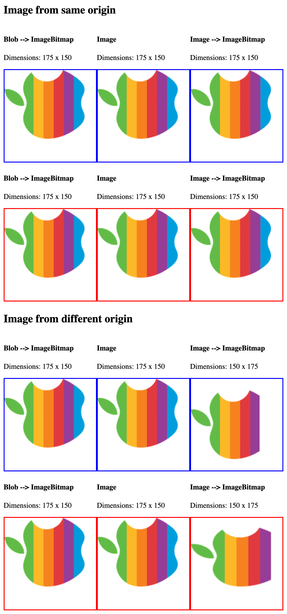

## `createImageBitmap` issue reproduction

`createImageBitmap` behaves weirdly with JPEG images with an EXIF orientation other than 1.

## Setup

1. Run `npm install`
2. Run `npm start` to start the server

## Results

### Chrome 106

`Image` --> `ImageBitmap` is cut off when `dWidth` and `dHeight` is provided to `ctx.drawImage`, it's stretched when `dWidth` and `dHeight` is omitted from the `ctx.drawImage`. Additionally, the image dimensions are flipped.

Adding `img.crossOrigin = 'anonymous'` to `fetchImage` seems to resolve the issue.

### Safari 16.1

`Blob` --> `ImageBitmap` is cut off, and EXIF orientation is not taken into account.

### Firefox 105

Exactly how it should be.

### Safari Technical Preview 156 (16.4)

Exactly how it should be.

